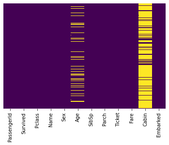
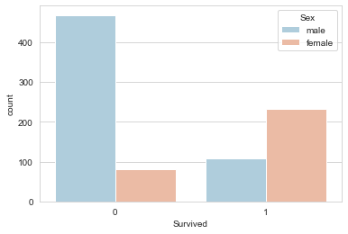
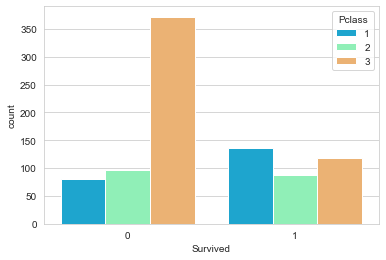
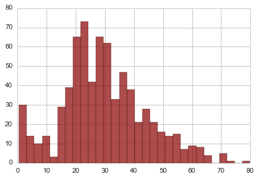
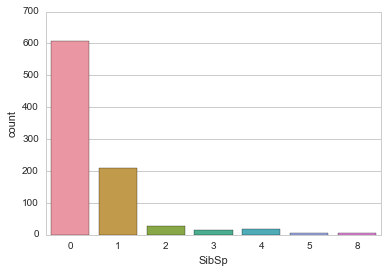
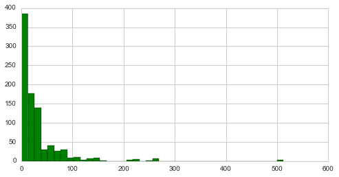
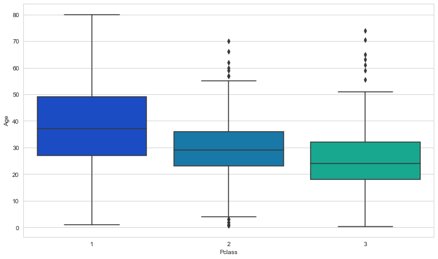
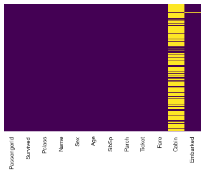

## Project: Survival predication for Titanic dataset (Logistic Regression in Python). 

dataset: [Titanic Data Set from Kaggle](https://www.kaggle.com/c/titanic) 


## Step 1: Import Libraries and read data into a pandas dataframe


```python
import pandas as pd
import numpy as np
import matplotlib.pyplot as plt
import seaborn as sns
%matplotlib inline
```


```python
train = pd.read_csv('titanic_train.csv')
```


```python
train.head()
```


<div>
<style scoped>
    .dataframe tbody tr th:only-of-type {
        vertical-align: middle;
    }

    .dataframe tbody tr th {
        vertical-align: top;
    }

    .dataframe thead th {
        text-align: right;
    }
</style>
<table border="1" class="dataframe">
  <thead>
    <tr style="text-align: right;">
      <th></th>
      <th>PassengerId</th>
      <th>Survived</th>
      <th>Pclass</th>
      <th>Name</th>
      <th>Sex</th>
      <th>Age</th>
      <th>SibSp</th>
      <th>Parch</th>
      <th>Ticket</th>
      <th>Fare</th>
      <th>Cabin</th>
      <th>Embarked</th>
    </tr>
  </thead>
  <tbody>
    <tr>
      <th>0</th>
      <td>1</td>
      <td>0</td>
      <td>3</td>
      <td>Braund, Mr. Owen Harris</td>
      <td>male</td>
      <td>22.0</td>
      <td>1</td>
      <td>0</td>
      <td>A/5 21171</td>
      <td>7.2500</td>
      <td>NaN</td>
      <td>S</td>
    </tr>
    <tr>
      <th>1</th>
      <td>2</td>
      <td>1</td>
      <td>1</td>
      <td>Cumings, Mrs. John Bradley (Florence Briggs Th...</td>
      <td>female</td>
      <td>38.0</td>
      <td>1</td>
      <td>0</td>
      <td>PC 17599</td>
      <td>71.2833</td>
      <td>C85</td>
      <td>C</td>
    </tr>
    <tr>
      <th>2</th>
      <td>3</td>
      <td>1</td>
      <td>3</td>
      <td>Heikkinen, Miss. Laina</td>
      <td>female</td>
      <td>26.0</td>
      <td>0</td>
      <td>0</td>
      <td>STON/O2. 3101282</td>
      <td>7.9250</td>
      <td>NaN</td>
      <td>S</td>
    </tr>
    <tr>
      <th>3</th>
      <td>4</td>
      <td>1</td>
      <td>1</td>
      <td>Futrelle, Mrs. Jacques Heath (Lily May Peel)</td>
      <td>female</td>
      <td>35.0</td>
      <td>1</td>
      <td>0</td>
      <td>113803</td>
      <td>53.1000</td>
      <td>C123</td>
      <td>S</td>
    </tr>
    <tr>
      <th>4</th>
      <td>5</td>
      <td>0</td>
      <td>3</td>
      <td>Allen, Mr. William Henry</td>
      <td>male</td>
      <td>35.0</td>
      <td>0</td>
      <td>0</td>
      <td>373450</td>
      <td>8.0500</td>
      <td>NaN</td>
      <td>S</td>
    </tr>
  </tbody>
</table>
</div>


## Step2: Exploratory Data Analysis


## Missing Data

Use seaborn to create a simple heatmap to see the missing data.


```python
sns.heatmap(train.isnull(),yticklabels=False,cbar=False,cmap='viridis')
```


    <AxesSubplot:>


    

    


Based on the heatmap, it indicates that roughly 20 percent of the Age data is missing. 
The proportion of Age missing is small enough for reasonable replacement with proper imputation. 
For the Cabin column, it's missing too much information at a basic level so I decide to drop it. 


```python
sns.set_style('whitegrid')
sns.countplot(x='Survived',hue='Sex',data=train,palette='RdBu_r')
```


    <AxesSubplot:xlabel='Survived', ylabel='count'>


    

    


```python
sns.set_style('whitegrid')
sns.countplot(x='Survived',hue='Pclass',data=train,palette='rainbow')
```


    <AxesSubplot:xlabel='Survived', ylabel='count'>


    

    


```python
train['Age'].hist(bins=30,color='darkred',alpha=0.7)
```


    <matplotlib.axes._subplots.AxesSubplot at 0x11b127ef0>


    

    


```python
sns.countplot(x='SibSp',data=train)
```


    <matplotlib.axes._subplots.AxesSubplot at 0x11c4139e8>


    

    


```python
train['Fare'].hist(color='green',bins=40,figsize=(8,4))
```


    <matplotlib.axes._subplots.AxesSubplot at 0x113893048>


    

    


## Step 3: Data Cleaning
Fill missing age data using the the average age by passenger class.


```python
plt.figure(figsize=(12, 7))
sns.boxplot(x='Pclass',y='Age',data=train,palette='winter')
```


    <AxesSubplot:xlabel='Pclass', ylabel='Age'>


    

    


It shows that wealthier passengers in the higher classes tend to be older.
Use average age values to impute based on Pclass for Age.


```python
def impute_age(cols):
    Age = cols[0]
    Pclass = cols[1]
    
    if pd.isnull(Age):

        if Pclass == 1:
            return 37

        elif Pclass == 2:
            return 29

        else:
            return 24

    else:
        return Age

```


```python
train[['Age','Pclass']]
```


<div>
<style scoped>
    .dataframe tbody tr th:only-of-type {
        vertical-align: middle;
    }

    .dataframe tbody tr th {
        vertical-align: top;
    }

    .dataframe thead th {
        text-align: right;
    }
</style>
<table border="1" class="dataframe">
  <thead>
    <tr style="text-align: right;">
      <th></th>
      <th>Age</th>
      <th>Pclass</th>
    </tr>
  </thead>
  <tbody>
    <tr>
      <th>0</th>
      <td>22.0</td>
      <td>3</td>
    </tr>
    <tr>
      <th>1</th>
      <td>38.0</td>
      <td>1</td>
    </tr>
    <tr>
      <th>2</th>
      <td>26.0</td>
      <td>3</td>
    </tr>
    <tr>
      <th>3</th>
      <td>35.0</td>
      <td>1</td>
    </tr>
    <tr>
      <th>4</th>
      <td>35.0</td>
      <td>3</td>
    </tr>
    <tr>
      <th>...</th>
      <td>...</td>
      <td>...</td>
    </tr>
    <tr>
      <th>886</th>
      <td>27.0</td>
      <td>2</td>
    </tr>
    <tr>
      <th>887</th>
      <td>19.0</td>
      <td>1</td>
    </tr>
    <tr>
      <th>888</th>
      <td>NaN</td>
      <td>3</td>
    </tr>
    <tr>
      <th>889</th>
      <td>26.0</td>
      <td>1</td>
    </tr>
    <tr>
      <th>890</th>
      <td>32.0</td>
      <td>3</td>
    </tr>
  </tbody>
</table>
<p>891 rows × 2 columns</p>
</div>


```python
train['Age']
```


    0      22.0
    1      38.0
    2      26.0
    3      35.0
    4      35.0
           ... 
    886    27.0
    887    19.0
    888     NaN
    889    26.0
    890    32.0
    Name: Age, Length: 891, dtype: float64


Now apply the function created.


```python
train['Age'] = train[['Age','Pclass']].apply(impute_age,axis=1)
```


```python
sns.heatmap(train.isnull(),yticklabels=False,cbar=False,cmap='viridis')
```


    <AxesSubplot:>


    

    


Drop the Cabin column and the row in Embarked that is NaN.


```python
train.drop('Cabin',axis=1,inplace=True)
```


```python
train.head()
```


<div>
<style scoped>
    .dataframe tbody tr th:only-of-type {
        vertical-align: middle;
    }

    .dataframe tbody tr th {
        vertical-align: top;
    }

    .dataframe thead th {
        text-align: right;
    }
</style>
<table border="1" class="dataframe">
  <thead>
    <tr style="text-align: right;">
      <th></th>
      <th>PassengerId</th>
      <th>Survived</th>
      <th>Pclass</th>
      <th>Name</th>
      <th>Sex</th>
      <th>Age</th>
      <th>SibSp</th>
      <th>Parch</th>
      <th>Ticket</th>
      <th>Fare</th>
      <th>Embarked</th>
    </tr>
  </thead>
  <tbody>
    <tr>
      <th>0</th>
      <td>1</td>
      <td>0</td>
      <td>3</td>
      <td>Braund, Mr. Owen Harris</td>
      <td>male</td>
      <td>22.0</td>
      <td>1</td>
      <td>0</td>
      <td>A/5 21171</td>
      <td>7.2500</td>
      <td>S</td>
    </tr>
    <tr>
      <th>1</th>
      <td>2</td>
      <td>1</td>
      <td>1</td>
      <td>Cumings, Mrs. John Bradley (Florence Briggs Th...</td>
      <td>female</td>
      <td>38.0</td>
      <td>1</td>
      <td>0</td>
      <td>PC 17599</td>
      <td>71.2833</td>
      <td>C</td>
    </tr>
    <tr>
      <th>2</th>
      <td>3</td>
      <td>1</td>
      <td>3</td>
      <td>Heikkinen, Miss. Laina</td>
      <td>female</td>
      <td>26.0</td>
      <td>0</td>
      <td>0</td>
      <td>STON/O2. 3101282</td>
      <td>7.9250</td>
      <td>S</td>
    </tr>
    <tr>
      <th>3</th>
      <td>4</td>
      <td>1</td>
      <td>1</td>
      <td>Futrelle, Mrs. Jacques Heath (Lily May Peel)</td>
      <td>female</td>
      <td>35.0</td>
      <td>1</td>
      <td>0</td>
      <td>113803</td>
      <td>53.1000</td>
      <td>S</td>
    </tr>
    <tr>
      <th>4</th>
      <td>5</td>
      <td>0</td>
      <td>3</td>
      <td>Allen, Mr. William Henry</td>
      <td>male</td>
      <td>35.0</td>
      <td>0</td>
      <td>0</td>
      <td>373450</td>
      <td>8.0500</td>
      <td>S</td>
    </tr>
  </tbody>
</table>
</div>


```python
train.dropna(inplace=True)
```

## Step 4: Converting Categorical Features 

Convert categorical features to dummy variables using pandas. (For machine learning algorithm to directly take in those features as inputs).


```python
train.info()
```

    <class 'pandas.core.frame.DataFrame'>
    Int64Index: 889 entries, 0 to 890
    Data columns (total 11 columns):
     #   Column       Non-Null Count  Dtype  
    ---  ------       --------------  -----  
     0   PassengerId  889 non-null    int64  
     1   Survived     889 non-null    int64  
     2   Pclass       889 non-null    int64  
     3   Name         889 non-null    object 
     4   Sex          889 non-null    object 
     5   Age          889 non-null    float64
     6   SibSp        889 non-null    int64  
     7   Parch        889 non-null    int64  
     8   Ticket       889 non-null    object 
     9   Fare         889 non-null    float64
     10  Embarked     889 non-null    object 
    dtypes: float64(2), int64(5), object(4)
    memory usage: 83.3+ KB


```python
sex = pd.get_dummies(train['Sex'],drop_first=True)
embark = pd.get_dummies(train['Embarked'],drop_first=True)
```


```python
train.drop(['Sex','Embarked','Name','Ticket'],axis=1,inplace=True)
```


```python
train = pd.concat([train,sex,embark],axis=1)
```


```python
train.head()
```


<div>
<style scoped>
    .dataframe tbody tr th:only-of-type {
        vertical-align: middle;
    }

    .dataframe tbody tr th {
        vertical-align: top;
    }

    .dataframe thead th {
        text-align: right;
    }
</style>
<table border="1" class="dataframe">
  <thead>
    <tr style="text-align: right;">
      <th></th>
      <th>PassengerId</th>
      <th>Survived</th>
      <th>Pclass</th>
      <th>Age</th>
      <th>SibSp</th>
      <th>Parch</th>
      <th>Fare</th>
      <th>male</th>
      <th>Q</th>
      <th>S</th>
    </tr>
  </thead>
  <tbody>
    <tr>
      <th>0</th>
      <td>1</td>
      <td>0</td>
      <td>3</td>
      <td>22.0</td>
      <td>1</td>
      <td>0</td>
      <td>7.2500</td>
      <td>1</td>
      <td>0</td>
      <td>1</td>
    </tr>
    <tr>
      <th>1</th>
      <td>2</td>
      <td>1</td>
      <td>1</td>
      <td>38.0</td>
      <td>1</td>
      <td>0</td>
      <td>71.2833</td>
      <td>0</td>
      <td>0</td>
      <td>0</td>
    </tr>
    <tr>
      <th>2</th>
      <td>3</td>
      <td>1</td>
      <td>3</td>
      <td>26.0</td>
      <td>0</td>
      <td>0</td>
      <td>7.9250</td>
      <td>0</td>
      <td>0</td>
      <td>1</td>
    </tr>
    <tr>
      <th>3</th>
      <td>4</td>
      <td>1</td>
      <td>1</td>
      <td>35.0</td>
      <td>1</td>
      <td>0</td>
      <td>53.1000</td>
      <td>0</td>
      <td>0</td>
      <td>1</td>
    </tr>
    <tr>
      <th>4</th>
      <td>5</td>
      <td>0</td>
      <td>3</td>
      <td>35.0</td>
      <td>0</td>
      <td>0</td>
      <td>8.0500</td>
      <td>1</td>
      <td>0</td>
      <td>1</td>
    </tr>
  </tbody>
</table>
</div>


Till now, the data is cleaned and prepared for training. 

# Step 5: Building a Logistic Regression model


## Train Test Split


```python
from sklearn.model_selection import train_test_split
```


```python
X_train, X_test, y_train, y_test = train_test_split(train.drop('Survived',axis=1), 
                                                    train['Survived'], test_size=0.30, 
                                                    random_state=101)
```

## Training and Predicting


```python
from sklearn.linear_model import LogisticRegression
```


```python
logmodel = LogisticRegression()
logmodel.fit(X_train,y_train)
```

    /Users/emma/opt/anaconda3/lib/python3.8/site-packages/sklearn/linear_model/_logistic.py:762: ConvergenceWarning: lbfgs failed to converge (status=1):
    STOP: TOTAL NO. of ITERATIONS REACHED LIMIT.
    
    Increase the number of iterations (max_iter) or scale the data as shown in:
        https://scikit-learn.org/stable/modules/preprocessing.html
    Please also refer to the documentation for alternative solver options:
        https://scikit-learn.org/stable/modules/linear_model.html#logistic-regression
      n_iter_i = _check_optimize_result(


    LogisticRegression()


```python
predictions = logmodel.predict(X_test)
```

## Last step: Evaluation the model

Check for precision,recall,f1-score using classification report.


```python
from sklearn.metrics import classification_report
```


```python
print(classification_report(y_test,predictions))
```

                  precision    recall  f1-score   support
    
               0       0.79      0.91      0.85       163
               1       0.81      0.62      0.71       104
    
        accuracy                           0.80       267
       macro avg       0.80      0.77      0.78       267
    weighted avg       0.80      0.80      0.79       267
    


## Suggestions for feature engineering:

* Try grabbing the Title (Dr.,Mr.,Mrs,etc..) from the name as a feature
* Maybe the Cabin letter could be a feature
